# Graph Database Implementation Guide: From Basic to Advanced

## Table of Contents
1. [Data Model Overview](#data-model-overview)
2. [Basic Implementation](#basic-implementation)
3. [Advanced Patterns](#advanced-patterns)
4. [Optimization Techniques](#optimization-techniques)
5. [Complex Business Scenarios](#complex-business-scenarios)
6. [Performance Tuning](#performance-tuning)

## Data Model Overview

### Basic Structure
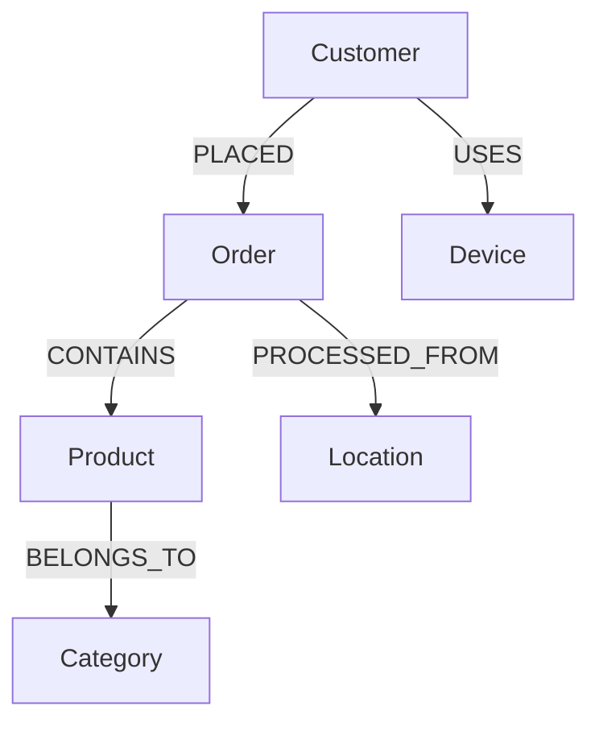

### Extended Relationship Model
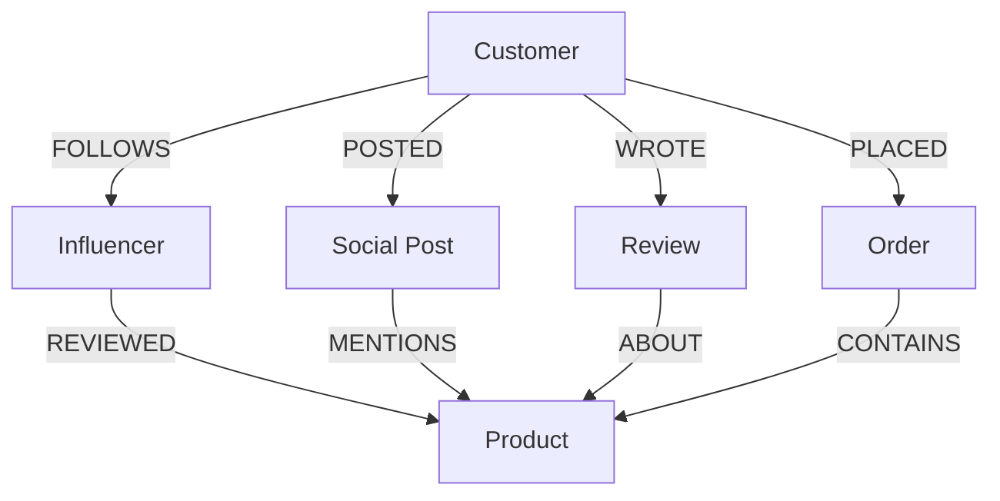

## Basic Implementation

### 1. Initial Setup
```cypher
// Create indexes for better performance
CREATE INDEX customer_id FOR (c:Customer) ON (c.id);
CREATE INDEX product_id FOR (p:Product) ON (p.id);
CREATE INDEX order_id FOR (o:Order) ON (o.id);

// Create constraints
CREATE CONSTRAINT customer_id_unique FOR (c:Customer) REQUIRE c.id IS UNIQUE;
CREATE CONSTRAINT product_id_unique FOR (p:Product) REQUIRE p.id IS UNIQUE;
```

### 2. Basic Node Creation
```cypher
// Create base nodes
CREATE (c:Customer {
    id: 'C001',
    name: 'John Smith',
    email: 'john@email.com',
    created_at: datetime()
})

CREATE (o:Order {
    id: 'O001',
    date: datetime(),
    amount: 299.99,
    status: 'PENDING'
})

// Create relationship with properties
CREATE (c)-[:PLACED {
    timestamp: datetime(),
    channel: 'web',
    session_id: 'sess_123'
}]->(o)
```

## Advanced Patterns

### 1. Customer Journey Pattern
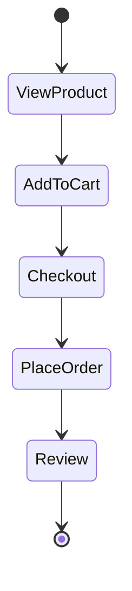

Implementation:
```cypher
// Track customer journey
MATCH path = (c:Customer {id: 'C001'})-[*]->(o:Order {id: 'O001'})
WHERE all(r in relationships(path) WHERE exists(r.timestamp))
RETURN path
```

### 2. Recommendation Engine Pattern
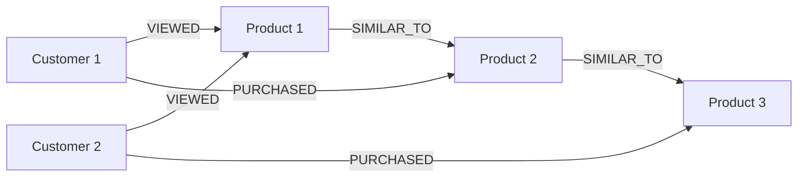

## Optimization Techniques

### 1. Index Strategy
```cypher
// Property indexes for frequent lookups
CREATE INDEX product_name FOR (p:Product) ON (p.name);
CREATE INDEX customer_email FOR (c:Customer) ON (c.email);

// Composite indexes for complex queries
CREATE INDEX order_date_amount FOR (o:Order) ON (o.date, o.amount);

// Full-text indexes for text search
CREATE FULLTEXT INDEX product_search FOR (p:Product) ON EACH [p.name, p.description];
```

### 2. Query Optimization
```cypher
// Use PROFILE to analyze query performance
PROFILE
MATCH (c:Customer)-[:PLACED]->(o:Order)-[:CONTAINS]->(p:Product)
WHERE c.id = 'C001'
RETURN c.name, collect(p.name) as products

// Use parameters instead of literals
MATCH (c:Customer)
WHERE c.id = $customerId
RETURN c
```

## Complex Business Scenarios

### 1. Fraud Detection
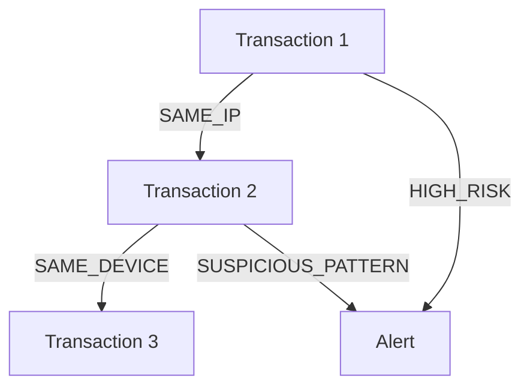

Implementation:
```cypher
// Find suspicious patterns
MATCH path = (t1:Transaction)-[*2..4]-(t2:Transaction)
WHERE t1.risk_score > 0.7
WITH path,
     reduce(weight = 0, r in relationships(path) |
        weight + coalesce(r.risk_score, 0)) as total_risk
WHERE total_risk > 2.0
RETURN path, total_risk
ORDER BY total_risk DESC
```

### 2. Customer 360 View
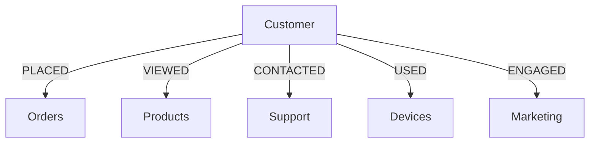

## Performance Tuning

### 1. Query Optimization Guidelines
- Use parameters instead of literals
- Limit result sets
- Use appropriate indexes
- Avoid cartesian products
- Consider query planning with PROFILE/EXPLAIN

### 2. Memory Configuration
```bash
# neo4j.conf optimizations
dbms.memory.heap.initial_size=2G
dbms.memory.heap.max_size=4G
dbms.memory.pagecache.size=4G
```

### 3. Monitoring Queries
```cypher
// Find slow queries
CALL dbms.listQueries()
YIELD queryId, elapsedTimeMillis, query
WHERE elapsedTimeMillis > 1000
RETURN queryId, elapsedTimeMillis, query
ORDER BY elapsedTimeMillis DESC;
```

## Best Practices Checklist

1. Data Model Design
   - [ ] Use meaningful node labels
   - [ ] Create appropriate indexes
   - [ ] Define constraints
   - [ ] Design for query patterns

2. Query Optimization
   - [ ] Use parameters
   - [ ] Profile queries
   - [ ] Set appropriate limits
   - [ ] Use efficient patterns

3. Maintenance
   - [ ] Monitor query performance
   - [ ] Update statistics
   - [ ] Regular cleanup
   - [ ] Backup strategy

## Common Patterns and Their SQL Equivalents

### Pattern 1: Hierarchical Data
SQL:
```sql
WITH RECURSIVE CategoryHierarchy AS (
    SELECT category_id, name, 1 as level
    FROM Categories
    WHERE parent_id IS NULL
    
    UNION ALL
    
    SELECT c.category_id, c.name, ch.level + 1
    FROM Categories c
    JOIN CategoryHierarchy ch ON c.parent_id = ch.category_id
)
SELECT * FROM CategoryHierarchy;
```

Neo4j:
```cypher
MATCH path = (c:Category)-[:CHILD_OF*]->(parent:Category)
RETURN path
```

### Pattern 2: Network Analysis
SQL:
```sql
-- Complex and potentially slow
WITH RECURSIVE NetworkConnections AS (
    SELECT from_id, to_id, 1 as depth
    FROM Connections
    WHERE from_id = 'start_node'
    
    UNION ALL
    
    SELECT c.from_id, c.to_id, nc.depth + 1
    FROM Connections c
    JOIN NetworkConnections nc ON c.from_id = nc.to_id
    WHERE nc.depth < 3
)
SELECT * FROM NetworkConnections;
```

Neo4j:
```cypher
MATCH path = (start:Node)-[*..3]->(end:Node)
WHERE start.id = 'start_node'
RETURN path
```

## Recommended Tools

1. Development
   - Neo4j Desktop
   - Neo4j Browser
   - Neo4j Bloom for visualization

2. Monitoring
   - Neo4j Metrics
   - Prometheus + Grafana
   - Custom logging

3. Testing
   - Cypher Shell
   - Neo4j Unit Testing
   - Load testing tools

## Advanced Business Scenarios

### 1. Supply Chain Management
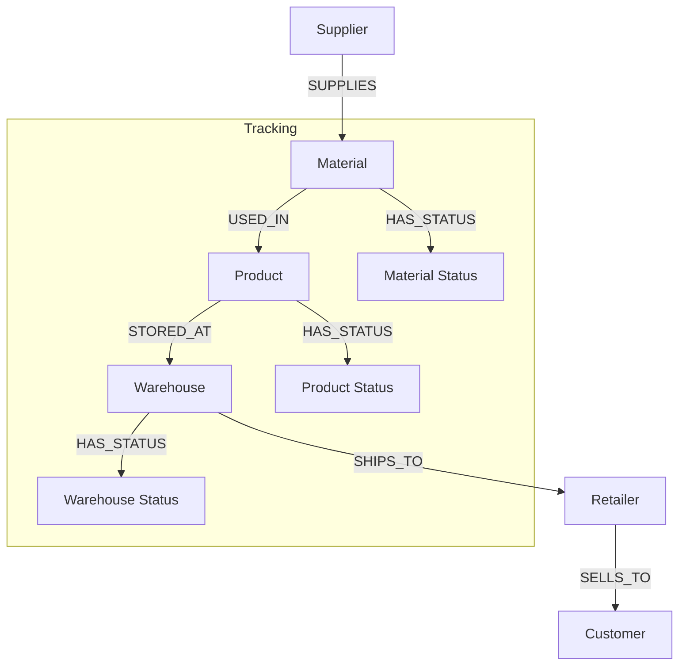

Implementation:
```cypher
// Track product journey with timestamps and status
MATCH path = (s:Supplier)-[:SUPPLIES]->()-[:USED_IN]->
             (p:Product)-[:STORED_AT]->()-[:SHIPS_TO]->()-[:SELLS_TO]->(c:Customer)
WHERE p.id = 'P001'
RETURN path,
       reduce(total = 0, r in relationships(path) |
           total + duration.between(r.start_time, r.end_time).days) as total_days
```

### 2. Risk Analysis System
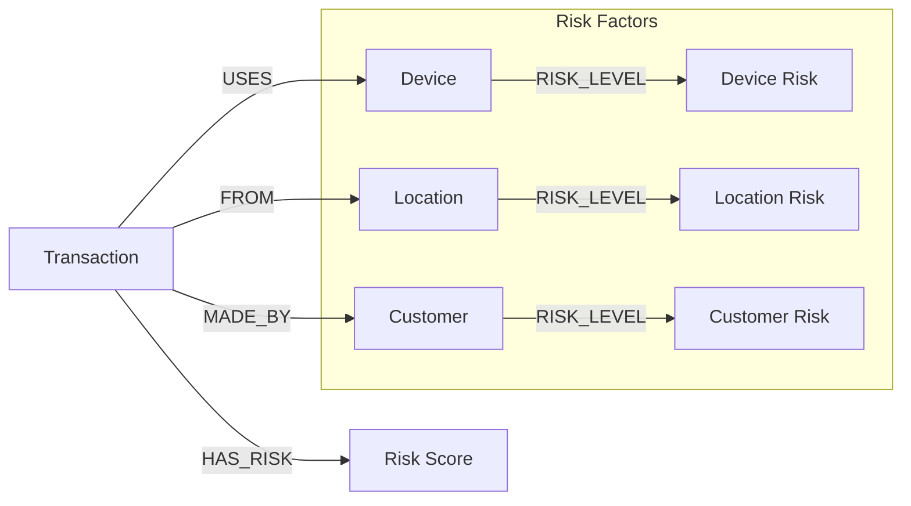

Complex Risk Assessment Query:
```cypher
// Calculate composite risk score
MATCH (t:Transaction)-[:MADE_BY]->(c:Customer),
      (t)-[:USES]->(d:Device),
      (t)-[:FROM]->(l:Location)
WHERE t.id = 'T001'
WITH t, c, d, l,
     coalesce(c.risk_score, 0) * 0.4 +
     coalesce(d.risk_score, 0) * 0.3 +
     coalesce(l.risk_score, 0) * 0.3 as composite_risk
WHERE composite_risk > 0.7
RETURN t.id, composite_risk
```

### 3. Customer Intelligence Platform
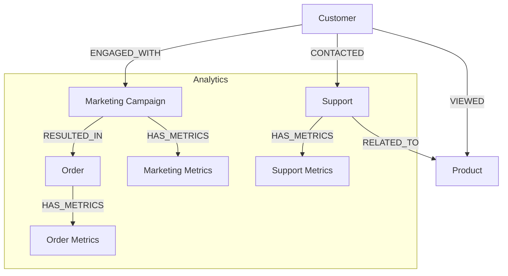

## Advanced Optimization Techniques

### 1. Query Pattern Optimization

Poor Pattern:
```cypher
// Inefficient query with cartesian product
MATCH (c:Customer), (p:Product)
WHERE c.segment = 'Premium' AND p.category = 'Electronics'
RETURN c, p
```

Optimized Pattern:
```cypher
// Using appropriate indexes and relationships
MATCH (c:Customer)-[:VIEWED|PURCHASED]->(p:Product)
WHERE c.segment = 'Premium' AND p.category = 'Electronics'
WITH DISTINCT c, p
RETURN c, p
```

### 2. Memory-Efficient Path Finding
```cypher
// Use path expander for memory-efficient traversal
MATCH (start:Customer {id: 'C001'})
CALL apoc.path.expandConfig(start, {
    relationshipFilter: 'PLACED|VIEWED|RATED',
    uniqueness: 'NODE_GLOBAL',
    maxLevel: 4
})
YIELD path
RETURN path
```

### 3. Batch Processing Pattern
```cypher
// Process large datasets in batches
MATCH (c:Customer)
WHERE c.lastProcessed IS NULL
WITH c LIMIT 1000
SET c.lastProcessed = datetime()
WITH collect(c) as batch
UNWIND batch as customer
MATCH (customer)-[:PLACED]->(o:Order)
WITH customer, collect(o) as orders
CALL apoc.do.when(
    size(orders) > 0,
    'RETURN size(orders) as count',
    'RETURN 0 as count',
    {orders: orders}
) YIELD value
RETURN sum(value.count)
```

## Complex Query Patterns

### 1. Recommendation Engine with Multiple Factors
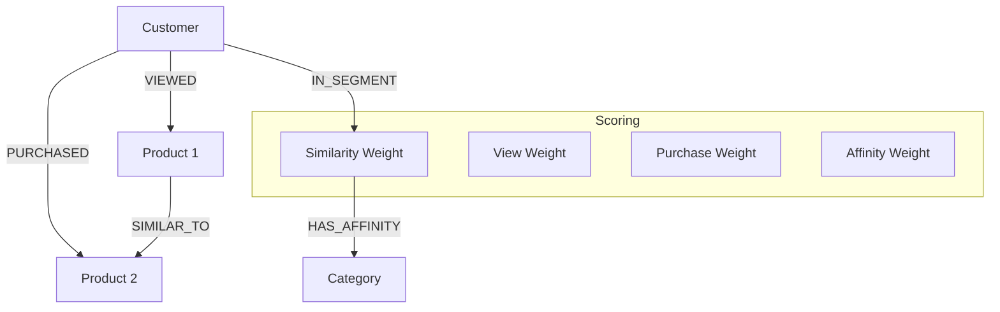

Implementation:
```cypher
// Complex recommendation query
MATCH (customer:Customer {id: $customerId})
MATCH (customer)-[:IN_SEGMENT]->(segment:Segment)
MATCH (segment)-[:HAS_AFFINITY]->(category:Category)
MATCH (product:Product)-[:IN_CATEGORY]->(category)
WHERE NOT (customer)-[:PURCHASED]->(product)

// Calculate different scores
WITH customer, product,
     // View similarity
     size((customer)-[:VIEWED]->(:Product)<-[:VIEWED]-(:Customer)-[:VIEWED]->(product)) as viewScore,
     // Purchase similarity
     size((customer)-[:PURCHASED]->(:Product)<-[:PURCHASED]-(:Customer)-[:PURCHASED]->(product)) as purchaseScore,
     // Category affinity
     coalesce(segment.categoryAffinity, 0) as affinityScore

// Combine scores with weights
WITH customer, product,
     (viewScore * 0.3 + 
      purchaseScore * 0.5 + 
      affinityScore * 0.2) as totalScore

ORDER BY totalScore DESC
LIMIT 10
RETURN product.name, totalScore
```

### 2. Real-time Fraud Detection Pattern
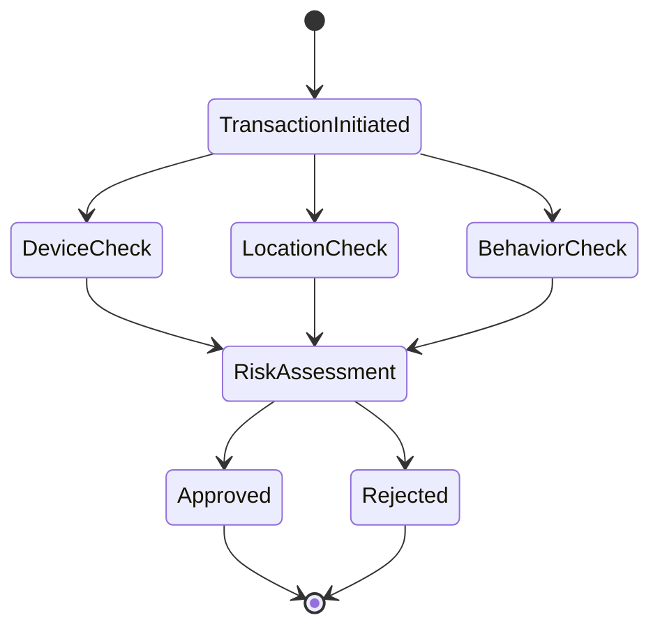

Implementation:
```cypher
// Real-time fraud detection
MATCH (t:Transaction {id: $transactionId})-[:MADE_BY]->(c:Customer)
MATCH (t)-[:USES]->(d:Device)
MATCH (t)-[:FROM]->(l:Location)

// Check device patterns
WITH t, c, d, l,
     size((c)-[:USED]->(d)) as device_familiarity,
     size((d)-[:USED_IN]->(:Transaction {status: 'FRAUDULENT'})) as device_fraud_count

// Check location patterns
WITH t, c, d, l, device_familiarity, device_fraud_count,
     point.distance(
         point({longitude: t.longitude, latitude: t.latitude}),
         point({longitude: l.lastKnownLong, latitude: l.lastKnownLat})
     ) as location_distance

// Check behavior patterns
WITH t, c, d, l, device_familiarity, device_fraud_count, location_distance,
     size((c)-[:MADE]->(:Transaction)
          WHERE duration.between(datetime(), t.timestamp).hours < 24) as tx_24h_count

// Calculate risk score
RETURN t.id,
       CASE 
           WHEN device_fraud_count > 0 THEN 1.0
           WHEN device_familiarity = 0 AND location_distance > 100000 THEN 0.8
           WHEN tx_24h_count > 10 THEN 0.7
           ELSE 0.1
       END as risk_score
```
